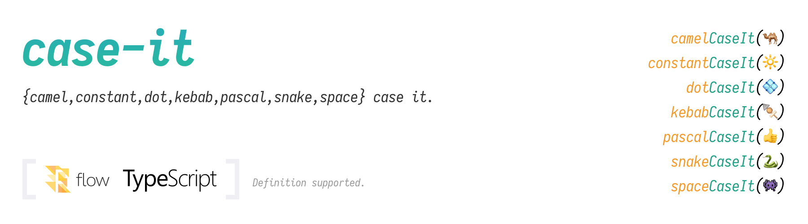

# [](https://github.com/firede/case-it)

[](https://www.npmjs.com/package/case-it)
[](https://travis-ci.org/firede/case-it)
[](./LICENSE.md)


Simple case conversion for strings, ported from [`to-case`](https://github.com/ianstormtaylor/to-case).

## Features

- Official support type definitions - both TypeScript and Flowtype.
- Single package, separate modules - easy to use, tiny bundles.
- No unnecessary detection tools - Just use `str === caseIt(str)`.
- Zero dependencies.

## Installation

```sh
npm install case-it
```

## Usage

Import:

```js
// Import by the main module
const { camelCaseIt } = require("case-it")

// Using the `import` statement (TypeScript, Babel, etc.)
import { dotCaseIt } from "case-it"

// Or just import the modules you need
const { constantCaseIt } = require("case-it/constant")
```

Case conversion:

```js
camelCaseIt("THIS_IS_A_STRING")   // "thisIsAString"
constantCaseIt("thisIsAString")   // "THIS_IS_A_STRING"
dotCaseIt("thisIsAString")        // "this.is.a.string"
kebabCaseIt("ThisIsAString")      // "this-is-a-string"
noCaseIt("thisIsAString")         // "this is a string"
pascalCaseIt("this is a string")  // "ThisIsAString"
snakeCaseIt("THIS_IS_A_STRING")   // "this_is_a_string"
spaceCaseIt("this_is_a_string")   // "this is a string"
```

Case detection:

```js
const str = "THIS_IS_A_STRING"

const strIsCamel = str === camelCaseIt(str)       // false
const strIsConstant = str === constantCaseIt(str) // true
```

## API

### `camelCaseIt(str: string): string`

Convert a `string` to camel case. (`"case-it/camel"`)

### `constantCaseIt(str: string): string`

Convert a `string` to constant case. (`"case-it/constant"`)

### `dotCaseIt(str: string): string`

Convert a `string` to dot case. (`"case-it/dot"`)

### `kebabCaseIt(str: string): string`

Convert a `string` to kebab case. (`"case-it/kebab"`)

### `noCaseIt(str: string): string`

Remove any starting case from a `string`, like camel or snake, but keep spaces and punctuation that may be important otherwise. (`"case-it/no"`)

### `pascalCaseIt(str: string): string`

Convert a `string` to pascal case. (`"case-it/pascal"`)

### `snakeCaseIt(str: string): string`

Convert a `string` to snake case. (`"case-it/snake"`)

### `spaceCaseIt(str: string): string`

Convert a `string` to space case. (`"case-it/space"`)

## License

### `case-it`

[The MIT License (MIT)](./LICENSE.md#case-it) - Copyright (c) 2018-present, Firede

### `to-case`

[The MIT License (MIT)](./LICENSE.md#to-case) - Copyright (c) 2016, Ian Storm Taylor
